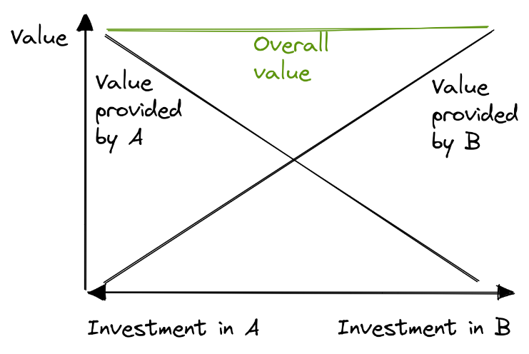
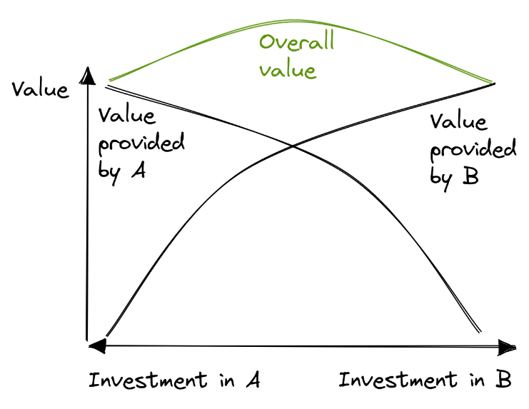

Which is better, A or B? A knowledgeable person will most often say, "it depends". It's all tradeoffs, after all! Rarely is one option universally better than another.

But it gets more interesting when the decision is not about a binary decision, but a spot on a spectrum. These FIND A GOOD WORD are very common, like when deciding how to allocate money or time. In software product development it may be: How much time should we spend improving what we have vs. adding new features?

Colored by the "A vs. B" lens, these tradeoffs are often seen as linear, or zero sum.

with neutral value function $v=B_1+B_2$. Benefit 1 as important as benefit 2, and linear scaling. Total value is constant over the whole range (draw).

Often discussion revolves around the weights, $B_1$ may be more important / impactful (draw line of value going down to the right)

However, in reality tradeoffs are rarely linear or zero-sum. (Assume neutral value function for simplicity)

Draw diagrams similar to the first where $B$ lines are curved up or down, and corresponding curved value function

("golden mean")

Important to know whether it is a "golden mean" situation or the opposite (name?), or zero sum. Tradeoffs need to be discussed very differently.

Find ways to turn tradeoffs into positive sum!

As a software dev my favourite example: Quality & Speed. With smart decisions, it can be a positive sum tradeoff. "go slow to go fast", model consistency, postpone the right decisions. Define quality as reducing dev friction in the long term (internal software quality)

The holy grail of software design.
