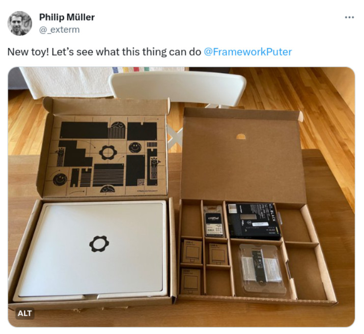
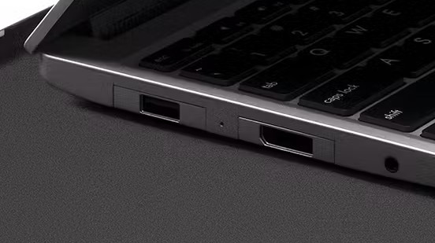
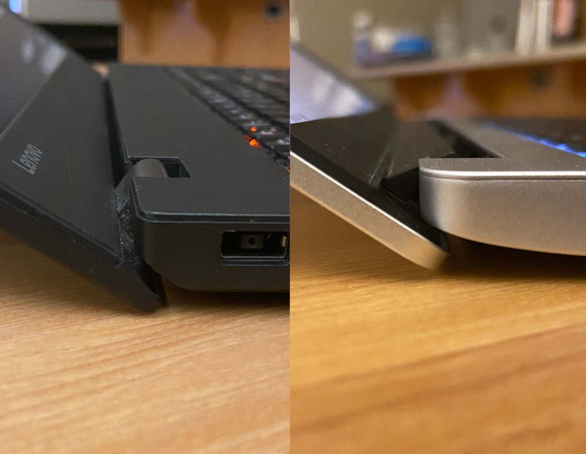
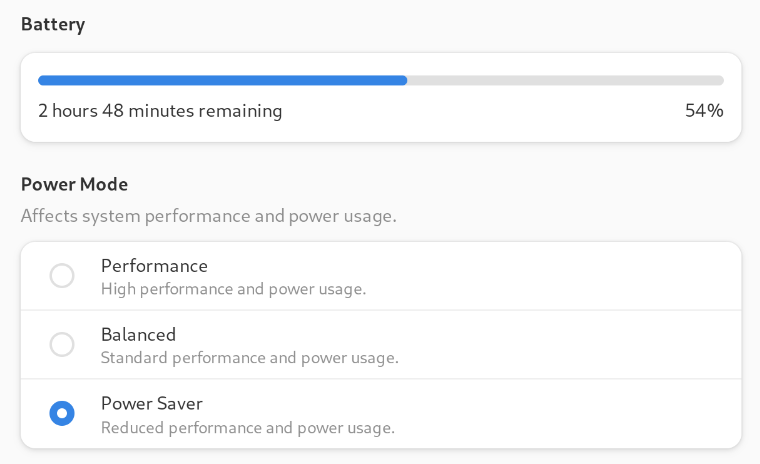

*Update 2023-10-21: Framework's CEO has [posted an update on the BIOS situation](https://community.frame.work/t/12th-gen-intel-core-bios-3-06-beta/25726/370), but it doesn't change my criticism. I will update this blog post once there's a final release of a patched BIOS.*

 

When I first heard about the Framework 13, a new laptop from [a company founded in 2020](https://frame.work), I was instantly excited. A focus on repairability and upgradeability to later generations of hardware? In a nice, slim package? I've been looking for something like this, especially as ThinkPads have gone a bit downhill since Lenovo took over.

So when I needed a new laptop in fall 2022, I decided to buy a Framework 13 (12th generation intel, DIY model).

Immediately, friends started asking for my opinion.

I've been using the laptop for a year now, so it's about time to do that.

My comparison points: I have been using Thinkpads (mostly T series) since 1998 as personal and work laptops, and Macbook Pros at work since 2016. I've encountered various other brands when doing IT support for family & friends. This is the first laptop I've bought that is not a Thinkpad.

## Look & Feel

The Framework looks sleek and modern overall. The only optical affordance to modularity is that the expansion ports are not a perfect fit. You'll see that even in official product photos.

The Framework might have the best laptop keyboard I've used since my first laptop, the 1998 Thinkpad 770. It has a nice and chunky feel, a good amount of key travel and just does what it is supposed to do. The trackpad is very smooth. Input wise I couldn't be happier.

There was no option for a matte screen with this model, but all screens are matte on current models (AMD and 13th gen Intel). The screen is otherwise very good, it's quite bright and has great color reproduction.

When you open the lid more than about 135 degrees, its back edge will hit the table. That's a bit annoying, but a common problem - the Thinkpad T560 I have here for comparison does the same, and my work MacBook (Pro 16, 2022) doesn't even open that far, which I find worse.

The Framework is very light and thin, but feels sturdy. The keyboard doesn't flex at all. The screen has  bit of flex, but not too much. Overall I'm very happy with the build quality, and the whole thing is super impressive for a modular laptop. It's on par with other good laptops that are a lot less modular.

## Practical Concerns

I dual-boot Windows (for games) and Fedora Linux (for everything else). Windows support is great, everything just works. Fedora Linux support is good, but not perfect. Everything worked out of the box except the built-in brightness buttons. For some reason these work only if automatic brightness is disabled. Brightness buttons on external keyboards work just fine (!?). I haven't looked into this further, but it's not a big deal for me.

More of a drawback is the less-than-perfect battery life. I get about 5 hours of battery life with the screen at 50% brightness while working / surfing on Fedora. That's not great. They've worked hard on this issue and reportedly battery life is a lot better on current models ([official statement](https://frame.work/ca/en/blog/testing-the-battery-life-of-framework-laptop-13-13th-gen-intel-core), [independent review](https://www.tomshardware.com/reviews/framework-laptop-13-intel-2023)).

Performance is as I'd expect in a thin-and-light. It's good but definitely impacted by the fact that a thin laptop can not dissipate heat as well as a desktop or a gaming laptop. If performance is important to you I'd recommend you look for up-to-date benchmarks of the model you're interested in ([example for 13th gen intel](https://www.pcgamer.com/framework-13-laptop-intel-core-i7-1370p-mainboard-review-benchmarks/)).

A few niceties on top: the keyboard lighting adjusts in three brightness levels (and can be turned off) via shortcut. Even the power button brightness can be adjusted in the BIOS. The power button also has a nice feel to it, it's not too easy to press accidentally, and it has a built-in fingerprint reader that works perfectly.

## Repairability / Upgradeability

I haven't had to repair anything yet and am not looking to upgrade until late 2024 at the earliest, but I had to do some assembly (I got the DIY version) and took the laptop apart again later out of curiosity. 

It's made to be disassembled and reassembled, and that shows. The modular design is very well thought out. There are little hints everywhere as well as QR codes that link to replacement parts in their web shop, and almost all the screws are the same. Chassis screws have little guards on them so they can't fall out. Framework has an extensive collection of well-made [repair guides](https://guides.frame.work/) too.

As for upgrading - I could put in the newest mainboard (or even switch to AMD), and I could swap my glossy screen for a matte one, without problem. There are upgraded hinges and speakers too, but what I have is good enough for now. I'm hoping that new parts will stay compatible for years to come - but that's what the company is building its reputation on, so I'm optimistic. So far, 2021, 2022 and 2023 model parts are compatible as far as the third party hardware (processors, chipsets) allows it.

## Framework as a Company

Framework Computer Inc was founded in 2020 by Apple alumni and former Oculus Head of Hardware Nirav Patel, with the promise of improving consumer electronics by making devices more repairable and upgradeable.

My impression is that they mean it. They really want to build a long term viable business on this promise. And they may just be able to pull it off. This laptop is extraordinary - it's simply a great laptop, and you get the advantages of modularity on top.

Sincerity and success of the company are important considerations since when you buy a Framework, you make a bet on the company being successful, otherwise repair and upgrade will become a lot more difficult. They've published [some schematics](https://github.com/FrameworkComputer/Framework-Laptop-13) but someone will still have to produce the parts.

They've been very transparent on most things so far. For example, there was a tricky issue with the laptops consuming too much power while in sleep. They've figured out the reason and provided [simple workarounds and more complex fixes to the input modules](https://frame.work/ca/en/blog/getting-ready-to-ship-13th-gen-and-announcing-power-saving-expansion-cards). New input modules are being shipped with the fix.

> We found unexpected CPU and retimer behavior in which placing a HDMI or DisplayPort Expansion Card on the same side of the laptop as any card other than USB-C could keep subsystems powered, whether or not a display was connected.

Of course it would have been better for this bug to never exist, but we're talking about a company in the second year of its existence, building a new laptop from scratch.

On the other hand, there is one thing I am really unhappy about. The current BIOS for the 12th gen Intel model has multiple publicly disclosed security vulnerabilities from 2022 that have not yet been patched. They [released a beta patch in December '22](https://community.frame.work/t/12th-gen-intel-core-bios-3-06-beta/25726), but as of October '23, almost a year later, the patch has not been finalized.

Similar problems do not seem to exist with the other models; a patch for the 11th gen model BIOS [has been released this year](https://community.frame.work/t/responded-11th-gen-intel-core-bios-3-17-release/25137) so they do seem to have people working on BIOSes. I hope the 12th gen BIOS issue is some kind of strange outlier that we'll get a good explanation for at some point.

## Conclusion

I'm very happy with most aspects of my Framework Laptop 13. I'm looking forward to using it for years to come, and to seeing what Framework will come up with next.

However, until they've patched the 12th gen Intel model's BIOS, I can't really recommend buying one.

Framework folks, if you're reading this - please get that BIOS patch ready, I would love to be able to recommend your products.
