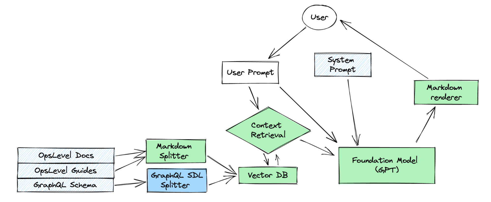
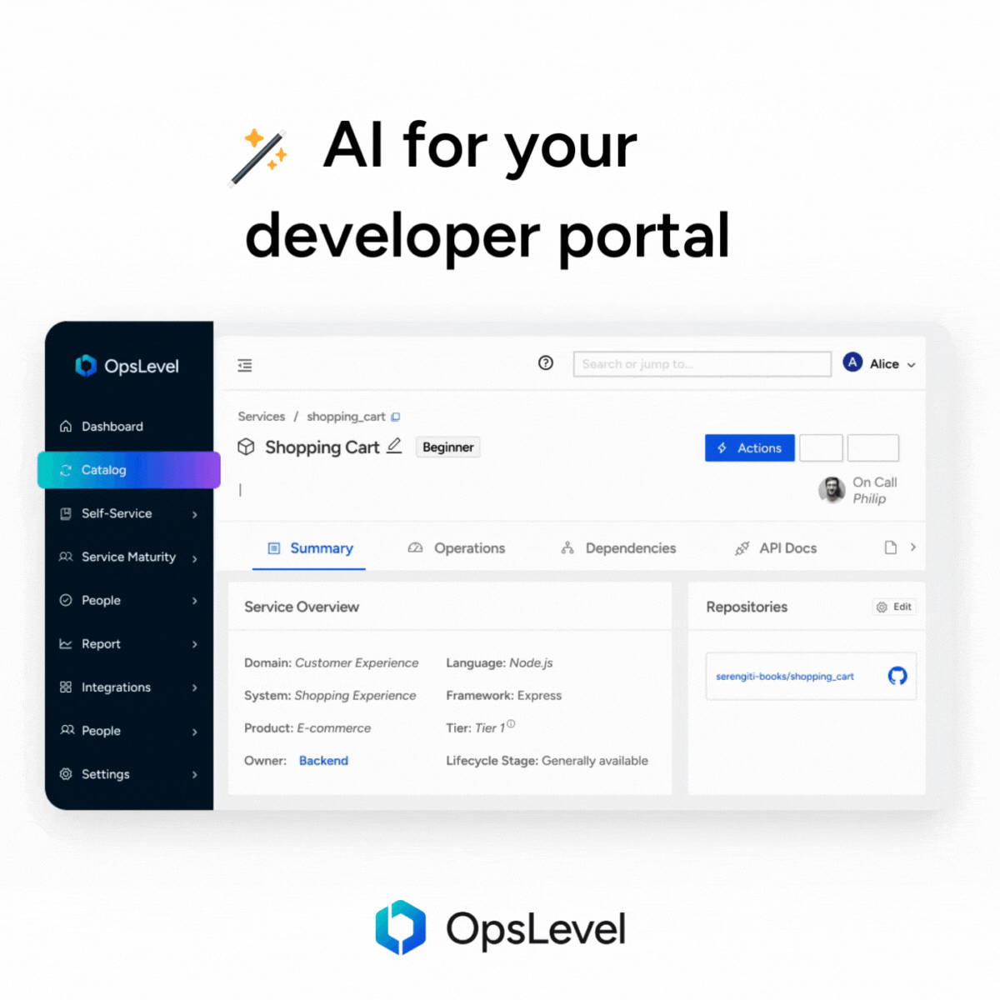

I was recently engaged by [OpsLevel](https://www.opslevel.com/) to investigate how to leverage LLM (Large Language Model) technology to improve their product. You might know this technology through OpenAI’s GPT models, but there are many other such models.

Read on to learn how I implemented a well-received production feature on top of the existing product using LLMs, and some of the non-obvious things I learned along the way.

## 👶👣 Starting “Simple”

To get familiar with the tooling around LLMs and their basic capabilities, I started with a relatively simple feature that I thought we could get to production quickly.

I decided to take two major shortcuts during this phase:

* Because the best models are huge and require a lot of specialized hardware to run, I was able to iterate a lot faster by using models hosted for us by third parties (instead of hosting them ourselves). This, at the time, meant I couldn’t do custom training, including fine tuning.
* Because OpsLevel’s customers are very protective of their data, they may not want an additional third party having access to it. I decided to reduce feature adoption risk by only using public OpsLevel data in this step.

The feature I chose as a first spike was a Q&A bot based on OpsLevel’s public documentation that would answer questions our users had about the product. The advantage for the user would be that they don’t have to search through the documentation to find the answer. Also, the bot would be able to combine information from multiple pages into one cohesive answer when the documentation didn’t answer that specific question directly.

### Implementation

While most of OpsLevel’s existing code is written in Ruby and TypeScript, I decided to use Python instead. Python has long been the most common language used in machine learning applications. The most prominent open source library for building LLM applications is [LangChain](https://python.langchain.com), which exists both as a JavaScript and a Python library. So Python & LangChain were obvious choices.

When I started this project in spring 2023, there wasn’t a huge selection of hosted LLMs, and OpenAI’s GPT models were significantly more capable than all competitors. I decided to use GPT-3.5 and GPT-4 via OpenAI’s API.

Later I also experimented with open source models hosted on [HuggingFace’s Inference Endpoints](https://huggingface.co/inference-endpoints) as a point of comparison. Last time I checked in late 2023, the open source LLMs still hadn’t fully caught up to the capabilities of GPT-4.

Now, how to make OpsLevel’s public documentation available to the Q&A bot? Neither of the GPT models seem to have been trained on it, and even if they had, that information would rapidly become outdated. One method to add knowledge to a model is fine tuning, but that wasn’t available on the GPT models in early 2023. It’s now available for GPT-3.5 but would probably not be sufficient for a knowledge retrieval task like this one. Fine tuning is best at picking up patterns, and we are looking for specific pieces of information.

So, can we just pass in all of the relevant context with the question? Sadly, it’s not that easy. LLMs have restricted context windows, limits on the amount of text you can pass in. Context windows are larger on newer releases on the models, but passing in too much irrelevant context can distract the model from the relevant parts.

So context selection is the name of the game: We need to pass only a selection of the most relevant context to the model.

I ended up using the technique most commonly applied for knowledge retrieval tasks: Retrieval Augmented Generation (RAG). It is sometimes also used to add mutable memory to LLMs. To implement RAG, we slice up all our knowledge into chunks of similar size, compute [embedding vectors](https://www.pinecone.io/learn/vector-embeddings/) for them and save snippets and vectors in a vector database. We can then in turn compute an embedding vector for each incoming query and use vector similarity search to find relevant chunks of context.

Luckily, all of OpsLevel’s public documentation was available to me in Markdown format, and LangChain has built-in support for splitting Markdown files. I later added the full, documented schema of OpsLevel’s GraphQL API to the vector database, which required me to write a custom splitter; and it turns out that GraphQL schemas, because of their strong hierarchical structure and cross references, are difficult to split in a useful way.

### Problems

Even this seemingly simple feature already presented some pretty complex problems in testing, resilience to malicious actors, truthfulness and complex reasoning.

#### Testing

Two things make automated testing for this mechanism difficult:

* Because of the inherently stochastic nature of LLMs, repeated execution with the same question will yield slightly different results
* Because the user input is unrestricted text, we can not exhaustively test the mechanism, or even enumerate all the edge cases

A test suite was still important though, because I needed to know how a modification of the system prompt or a tweak to a splitter would affect response quality, and manual testing would have taken way too long.

I came up with a list of realistic questions, added a few obvious edge cases (e.g. I wanted the bot to refuse to answer questions like “What do you think of Donald Trump?”), and implemented a simple fuzzy matching mechanism using regular expressions to check the responses. The test suite would run against the actual OpenAI API since there is no way to test the effect of prompts or other parts of this mechanism on the model response without using the actual model. The test suite would make parallel API calls to save time.

This test suite was still not very stable and would exhibit random failures, but it was OK for a single person working on it. Had we continued down this path, I would have added a statistical mechanism to run each test case multiple times and fail the case only if the success rate of repeated execution is below a certain threshold. That would have increased the costs of running the test suite considerably though.

#### Resilience to Malicious Actors

The most common and well known attack against LLM based products is prompt injection. In prompt injection, instructions supplied by the end user override a model’s original instructions. This can lead to a chat bot [selling a brand new car for $1](https://gmauthority.com/blog/2023/12/gm-dealer-chat-bot-agrees-to-sell-2024-chevy-tahoe-for-1/) or spewing lies and hate speech.

Even though since the publication of GPT-3 there has been a lot of research into prompt injection and mitigation thereof, to my knowledge there’s still no way to harden a model in a way that will make it 100% resilient to these attacks. I’ll mention a few mitigation techniques later on in this post.

Because the user supplied question is part of the prompt in this Q&A bot, prompt injection is possible, and attackers can iterate on their prompt rapidly, which makes attacks even easier.

#### Truthfulness

I was not able to reliably have the bot respond “I don’t know” when it doesn’t know the answer to a question. In most cases, if it doesn’t have access to the correct answer, it would give an incorrect one.

This is especially problematic because the knowledge required to answer most questions about OpsLevel is not part of the training set. The LLM has not been trained on OpsLevel’s (current) documentation. The relevant context is supplied through RAG, which has serious limitations.

For one, I discovered that the vector similarity search (at least through Chroma, the vector database I used) was heavily skewed towards smaller snippets.

Also:

* Langchain’s built-in splitters are not great at generating snippets of similar size.
* Because snippet size varied and was unpredictable, it was difficult to predict how many snippets would fit, and thus to make full use of the context window.
* Text splitting is difficult to get right in a way that snippets are approximately the same size and their content is mostly cohesive.
* Vector similarity search via embedding vectors [doesn’t work great if the embedding model isn’t trained on the underlying data](https://www.pinecone.io/learn/hybrid-search-intro/#Out-of-Domain-Datasets).

Often one question would get an incorrect answer but a slightly reworded version of the same question would get a correct answer; a sign that hallucinations might be caused by problems with context selection.

To investigate this problem, I modified the test suite so that whenever the bot response was unsatisfactory it would log the context snippets fetched from the vector database. The result: In my tests with GPT-4, incorrect answers were always caused by insufficient information resulting from the similarity search.

#### Complex Reasoning

For some more complex questions, for example when the user asks how to do something that requires multiple steps that are not spelled out explicitly in the documentation, GPT-3.5 was struggling and often started hallucinating, even if all the relevant information was provided via RAG.

Example: For the question “How do I create a service with two tags?”, the mechanism needs information both about service creation and tagging, and then explain how to do both in sequence.

Switching to a more capable model (in this case GPT-4) solved this issue, but increased answer times and costs per execution significantly.

## 🪄 How To Do Magic

If this seemingly simple feature presents so many non-trivial problems, how come we are hearing about super impressive product features based on LLMs on a weekly, sometimes daily, basis?

I decided to take a closer look at some of those “breakthroughs”[^1][^2]. Two things stuck out:

1. Many of the demos were non-interactive. It’s relatively easy to make an LLM-based feature produce astonishingly good, convincing results for cases that the mechanism is optimized for. However, it is multiple orders of magnitude harder to keep it from misbehaving for unexpected inputs. Pre-recording the demos lets companies advertise with fancy features before they’ve solved the hard part of the problem.
2. LLMs are exceptionally good translators between languages that they have either been trained on or that can be fully specified within the context window. Companies that have a powerful search or reporting engine with a relatively simple (yet seeming complex to humans) query language can easily put a natural language interface on top using an LLM, and suddenly have a powerful natural language query engine. It all depends on that strong foundation.

Both of these shortcuts were unavailable to me: OpsLevel wanted a feature that provides actual value to customers, and its built-in search and reporting capabilities were at that point relatively simple. I had to find another way.

### The Plan

So, I was unable to take any of the usual shortcuts. I still wanted to deliver customer value quickly, with something that could serve as a first step to broader LLM integration into the OpsLevel product.

The following facts came in handy:

* A big part of customer onboarding in OpsLevel is filling the catalog with useful information. A lot of information we can fetch through integrations, but other information may not previously have been explicit and thus needs to be added by humans manually.
* Many organizations and teams choose cute nicknames for services and libraries that are not self-documenting, like [Galactus or Omega Star](https://www.youtube.com/watch?v=y8OnoxKotPQ).
* Truthfulness is only a strong requirement if the output of the LLM is presented as authoritative, which it usually is for chatbots, but doesn’t have to be for something that’s only making suggestions.

So my co-workers at OpsLevel and I decided together to pursue a mechanism that suggests descriptions for services and libraries that don’t already have a user-provided description.

## 🕴️🍸 Agent Double-L M

The best available information OpsLevel has on a service is the associated source code repository, often through Github or Gitlab. I experimented with multiple approaches to generate descriptions for services from that information.

First, I tried a mechanism that would look for a README file and feed that into the LLM with the instruction to generate a service description out of it. Often though, the README would just not contain enough information to generate a description, and some repositories didn’t even have a README. The success rate of this approach was quite low.

Second, I tried aggregating all Markdown files in the repository via a map-reduce process with repeated LLM calls. It quickly became clear that most of the documentation in the typical source code repository is about how to do specific things with it, not about the overall responsibilities of the code.

But we know that the responsibilities are defined in the repository; they are defined in the code, and modern LLMs can work with source code directly. Now, the typical repository contains a lot of code, and passing all of it to the LLM would have been slow and expensive, even with a parallelized map-reduce approach. Essentially, I had another context selection problem at my hands. But after the struggle with applying RAG to the GraphQL schema, I was ready to try a different approach.

Enter LLM agents. To implement an LLM agent, you present the LLM with a task, together with a list of possible actions. The LLM can then choose an action to execute, and an execution harness around the LLM executes the action and passes the result back into the LLM. One of the possible actions is to render a final response. The LLM decides what steps to take in which order and how many steps to take before rendering a final result.

In my case, the possible actions implemented were:

* List directory contents
* Get current working directory (relative to repository root)
* Change current working directory
* Read file (using map-reduce if the file is too large for the context window)

This way, the LLM itself does the context selection, and it does so in a very similar way to how a human would do it. That means it makes use of the fact that the code was written, and the directory structure built, by humans for humans. Meaning also, this mechanism will work better on repositories that are well structured, with code that uses consistent naming schemes, etc.

To present the list of actions and let the LLM choose one, I used [OpenAI’s optimizations for function calling](https://platform.openai.com/docs/guides/function-calling), but it’s also possible, although less reliable, with models not optimized for it.

Again, I implemented a test suite with fuzzy matching, which was needed to be able to iterate on the mechanism. A few edge cases were obvious: Empty repository, repository with only markdown files that didn’t provide enough information for a description, repository with a huge number of files, and different programming languages.

It took quite a bit of tweaking to both the prompts and the output format of the actions, but in the end, the mechanism reliably generated useful descriptions in most cases.

OpsLevel itself was of course an early adopter of this feature, and one of our internal users was so enthusiastic that they deleted all the human-generated descriptions on their libraries to replace them with the agent-generated ones, feeling that they were more helpful.

Read more about inferred service descriptions in the [OpsLevel docs](https://docs.opslevel.com/docs/ai-inferred-service-descriptions).

### Caveats

Prompt injection is still possible in this mechanism: The customer can, in theory, use “poisoned” repositories to change the behavior of the agent and thus the results. However, all that would do is reduce the quality of the data the agent generates for them, so they would only hurt themselves. The agent has no capabilities that would cause side effects; I know that since I implemented all of its capabilities by hand, and they are all read-only. The agent is also cut off if it takes too much time, so getting it caught in an infinite loop is not a meaningful attack. And the contents of one repository are always only used for exactly one service, so one poisoned service can not degrade suggestions for other services.

I also considered the possibility of inadvertent prompt injection; e.g. if a repository contains documentation about prompt injections, and the agent is ingesting that. However, to actually overwrite the agent’s instructions, the format of the system prompt would have to be matched; and even then, the worst thing that could happen is a nonsensical or offensive auto-generated description. And because user-generated descriptions always override the agent-generated ones, that’d be an easy fix for the user.

Of course, there will still be rare edge cases in which the output of the agent is wrong or misleading for other reasons. We made sure to clearly label all auto generated descriptions as suggestions to reduce confusion in those cases.

## 📝 Some useful things I learned

* LLMs aren’t great at search! They only have direct access to information that they’ve been trained on and easily get confused about facts that weren’t repeated often enough in the training set. Additional information can be added to the prompt, however we need a search engine to determine which information is relevant… so the search problem is not solved by an LLM.
* Vector similarity search can easily be skewed by snippet size, which can lead to some really surprising results with response quality varying widely between very similar prompts.
* Running, or even training, models yourself  is difficult and expensive and doesn’t lend itself to rapid prototyping.
* Open Source LLMs are still significantly behind OpenAI but a combination of fine tuning & RAG may be able to close that gap. Note that fine tuning is now also available on GPT-3.5, which should enable it to become a lot more capable at specific tasks.
* OpenAI’s published innovations since the release of GPT-4 mostly concern tooling, UX, and monetization; fundamental capabilities have stayed similar.
* Langchain does a lot of things but is at times confusing, unstable and buggy. It’s still a great framework for rapid prototyping, and, if you’re careful, for production applications. Just make sure everything works as expected.

_Update 2024-02-16: Microsoft just published new research on [GraphRAG](https://www.microsoft.com/en-us/research/blog/graphrag-unlocking-llm-discovery-on-narrative-private-data/), an improved approach to RAG that uses a knowledge graph for retrieval. It looks very promising and could solve many of the problems I encountered._

## Further Reading

* Github published a [great blog post](https://github.blog/2023-10-30-the-architecture-of-todays-llm-applications/) about all the key pieces and how they fit together.
* Honeycomb published a similarly [great blog post](https://www.honeycomb.io/blog/hard-stuff-nobody-talks-about-llm) about some other common problems when building with LLMs.
* Check out [OpsLevel's docs for inferred service descriptions](https://docs.opslevel.com/docs/ai-inferred-service-descriptions).

[^1]:
     [Glean Chat launch announcement](https://www.glean.com/blog/glean-chat-launch-announcement)

[^2]:
     [HoneyComb: Introducing Query Assistant](https://www.honeycomb.io/blog/introducing-query-assistant)
