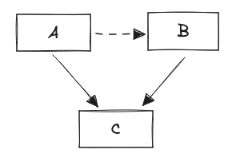

Managing complexity is one of the hardest parts of developing software systems. Inversion of Control is the most important tool we have available. However, I find that it's not generally well understood and people tend to shy away from it. Let's talk about where you'd even use it.

An architectural boundary lets you cut a software system into two parts where one doesn’t know about the other and is thus not going to be affected by changes to it. Boundaries are the only thing that can decouple local complexity from global complexity. If you want to make large software systems easy to work with, you'll want to have them.

A visual way to describe boundaries is as lines you draw in an architecture diagram that are only crossed by dependencies in one direction. This restriction of unidirectionality can not generally be imposed on control flow. We need a way to make dependencies independent of control flow. That's where Inversion of Control comes in.

## Patterns

Note that the kind of dependency we care about here is a static reference.


## Pseudocode Examples
### No Inversion


```ruby
# a.rb

require 'b'

def do_something()

  # ...

  b.do_something_else()

end
```

### Full Decoupling



```ruby
# a.rb

require 'c'

def do_something()

  # ...

  c.thing_was_done()

end
```

```ruby
# b.rb

require 'c'

def initialize()

  c.register(self)

end
```

```ruby
# c.rb

def thing_was_done(payload)

  listeners.each do |listener|

    listener.thing_was_done(payload)

  end

end
```

### Plugin Mechanism


```ruby
# a.rb

def do_something()

  # ...

  thing_was_done()

end

def thing_was_done()

  listeners.each do |listener|

    listener.thing_was_done()

  end

end
```

```ruby
# b.rb

require 'a'

def initialize()

  a.register(self)

end

def thing_was_done()

  # ...

end
```

## Caveats

Inversion of control does obscure the control flow to a degree. While the call stack is preserved in exceptions, traces and logs since everything still happens synchronously in-process, “who calls who” is a lot less obvious from reading the code. 

Therefore, we shouldn’t aim to resolve all boundary violations through Inversion of Control; often there are more straightforward solutions. But Inversion of Control is a useful tool that should be applied in some cases, and it serves well to illustrate the advantages of unidirectional boundaries.
